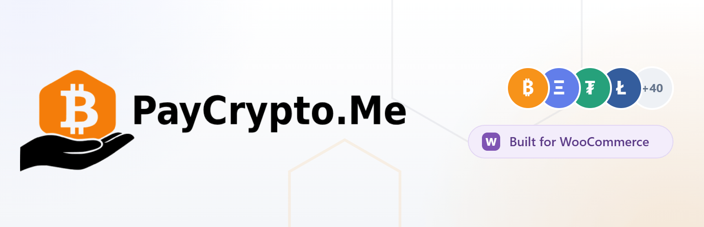

# PayCrypto.Me for WooCommerce

Accept Bitcoin On-Chain and Lightning Network payments directly in your WooCommerce store. PayCrypto.Me is self-hosted and non-custodial: payments go straight to a wallet or node you control, with no PayCrypto.Me account, intermediary, or percentage fee from us.

[Learn more](https://paycrypto.me/woocommerce) · [Install from WordPress.org](https://wordpress.org/plugins/paycrypto-me-for-woocommerce/) · [Get support](https://wordpress.org/support/plugin/paycrypto-me-for-woocommerce/)

## Features

- **Bitcoin On-Chain:** derive a unique address for every order from an xPub, yPub, or zPub, or use a fixed receiving address
- **Bitcoin Lightning:** connect directly to your own BTCPay Server or lnd node
- **Non-custodial:** your store connects to infrastructure you own and your funds never pass through PayCrypto.Me
- **Modern checkout support:** compatible with WooCommerce Blocks, classic checkout, and High-Performance Order Storage (HPOS)
- **Express Payment:** optionally add a one-click “Buy with Bitcoin” button at checkout
- **Customer-friendly payment details:** QR codes, copy-to-clipboard, and wallet deep links on the Thank You and My Account pages
- **Merchant tools:** payment details on the admin order screen, connection testing, and WooCommerce debug logs
- **Internationalized:** includes translations for Brazilian Portuguese, Spanish, French, German, Italian, Russian, and Simplified Chinese

Bitcoin is currently the only supported cryptocurrency. The free plugin does not automatically confirm payments or convert fiat order totals to BTC/sats; these remain manual workflows.

## Installation

The plugin is available from the official WordPress Plugin Directory:

1. In WordPress, go to **Plugins → Add New Plugin**.
2. Search for **PayCrypto.Me for WooCommerce**.
3. Click **Install Now**, then **Activate**.
4. Go to **WooCommerce → Settings → Payments**.
5. Configure and enable **Bitcoin** (On-Chain), **Bitcoin Lightning**, or both.

You can also [download the plugin from WordPress.org](https://wordpress.org/plugins/paycrypto-me-for-woocommerce/) and upload the ZIP through **Plugins → Add New Plugin → Upload Plugin**.

WooCommerce must be installed and active. The plugin requires WordPress 6.5 or newer and PHP 8.1 or newer. HD address derivation requires the PHP `gmp` extension; a fixed bech32 address can be used without it. QR-code generation requires the PHP `gd` extension.

## Configuration

### Bitcoin On-Chain

Add an xPub, yPub, or zPub to derive a fresh receiving address for each order (recommended), or configure a fixed bech32 address. Choose mainnet or testnet and set the payment timeout and required confirmations to suit your store.

### Bitcoin Lightning

Choose BTCPay Server or lnd REST, enter your node connection details, and use **Test connection** before enabling the gateway. API keys, macaroons, and TLS certificates are sensitive credentials; use least-privilege access and protect your WordPress database and backups.

Never enter a wallet seed or private key into this plugin.

## Development

The distributable WordPress plugin lives in `src/trunk`. For local development and release instructions, see the documentation in [`docs`](docs/).

The Base plugin also exposes a versioned payment-status projection contract for the separate Pro
add-on. It publishes capability discovery and an atomic, invoice-identified Lightning status
write-back; confirmation, polling, reconciliation and fiat conversion remain outside this plugin.
The contract shipped in version 0.3.0 and is covered by the plugin's unit and real-MySQL suites.

Enable logging in the gateway settings and inspect events under **WooCommerce → Status → Logs** using the `paycrypto_me` source.

## Contributing

Bug reports, feature requests, and pull requests are welcome through this GitHub repository. Please include clear reproduction steps and tests where appropriate.

## Support

- [Plugin overview and documentation](https://paycrypto.me/woocommerce)
- [WordPress.org support forum](https://wordpress.org/support/plugin/paycrypto-me-for-woocommerce/)
- [GitHub issues](https://github.com/paycrypto-me/paycrypto-me-for-woocommerce/issues)

## License

Licensed under the GPL-3.0-or-later. See [`LICENSE`](LICENSE) for details.
